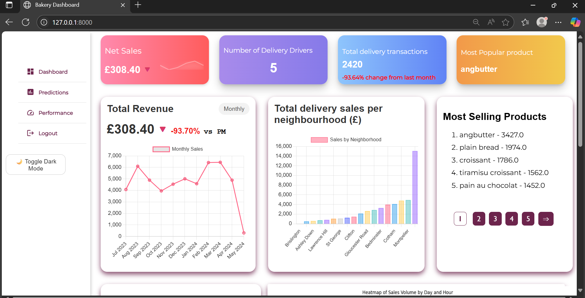
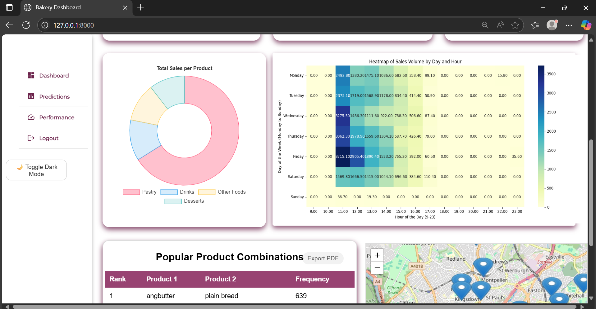
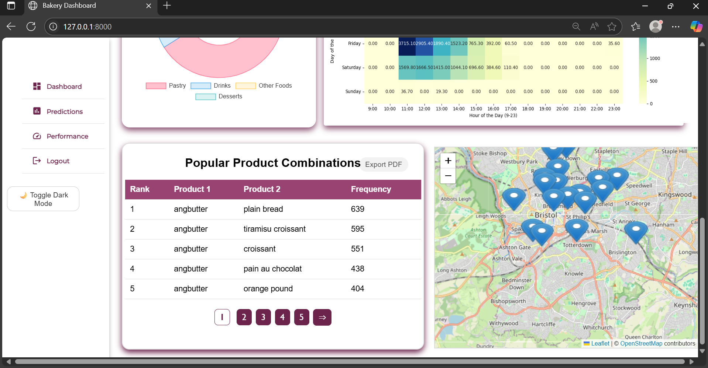
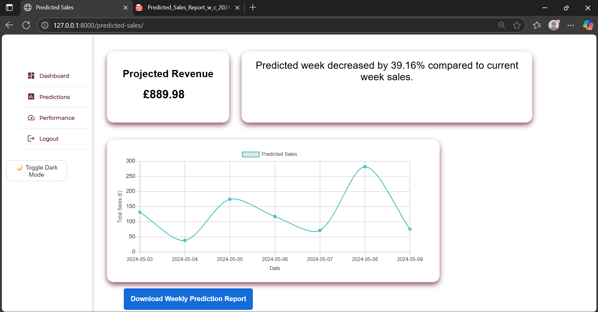
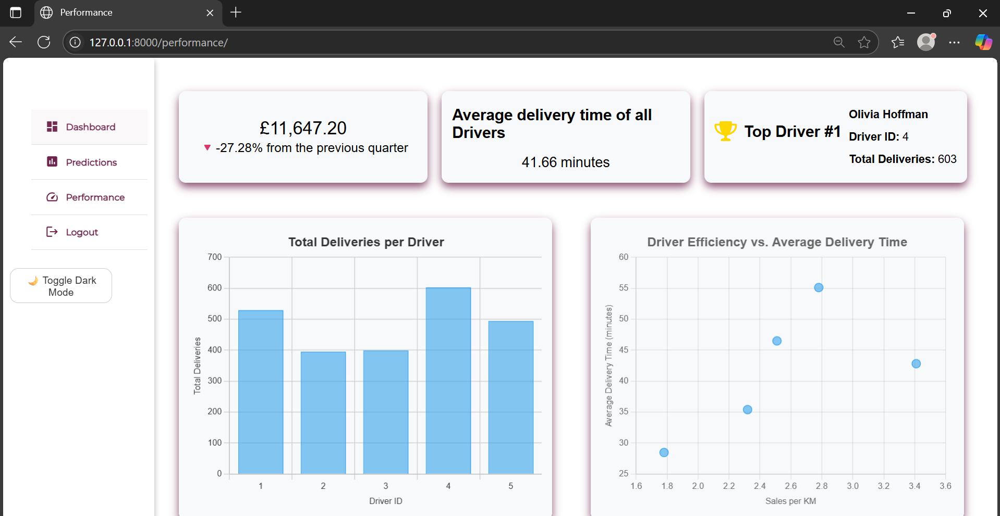
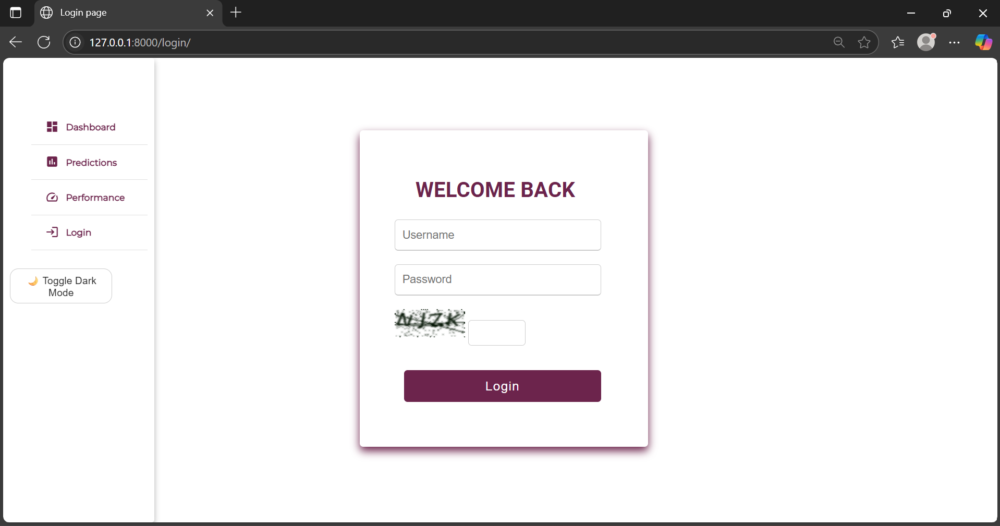
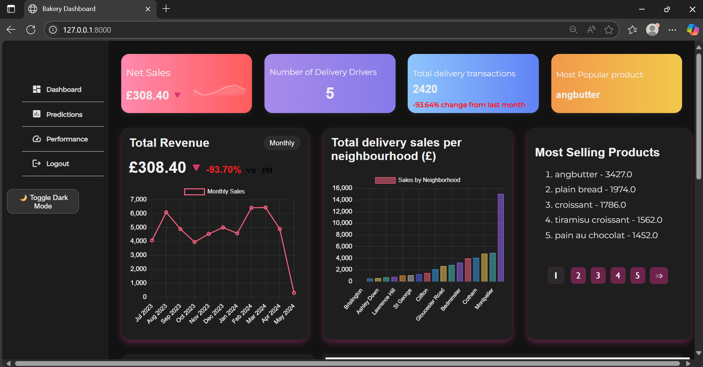

# 🥐 Bakery Delivery Dashboard

## 📌 Introduction

This project delivers a comprehensive Bakery Delivery Dashboard designed to monitor and analyse delivery operations through real-time and predictive analytics. The dashboard features dynamic graphs, summary cards, and various visualisations to display key performance indicators (KPIs) such as sales, deliveries, and driver activity.

A hybrid CNN-LSTM machine learning model was developed to forecast weekly sales based on historical transaction data, providing actionable insights to optimise operations.Users can also download detailed weekly sales prediction reports as PDFs for easy sharing and offline review.

The implementation involved extensive data cleaning, leveraging Neo4j as a graph database to manage transactions and driver information efficiently, and building a secure, user-friendly full-stack web application using Django. This system enables stakeholders to track performance metrics and forecast sales effectively.

Additionally, the dashboard supports a dark mode interface, enhancing usability for users who prefer a low-light theme.

---

## 🖥️ UI Screenshots

Here are screenshots showcasing the main pages of the Bakery Delivery Dashboard:

### Dashboard Overview

### Weekly Sales Forecast

### Download Weekly Sales Prediction PDF Report generation 

Users can download a detailed PDF report summarising the weekly sales prediction along with key performance indicators (KPIs). This feature enables easy sharing and offline review of forecast data for managers to keep track of.

[Download latest PDF Report](readme_image/Predicted_Sales_Report_w_c_2024-05-03.pdf)

*Example of the generated weekly sales prediction report showing key figures and charts.*

The PDF report includes:  
- Predicted revenue and sales figures  
- Charts and graphs visualising forecasted trends  
- A summary of key metrics for the predicted week
- Highest days and lowest days and etc

### Driver Performance

### Login 
 

### Dashboard in Dark Mode – user-friendly low-light theme for better accessibility

---

## 🔑 Key Features

- 📊 Real-time dashboard visualising KPIs (sales, deliveries, driver activity)  
- 🤖 Weekly sales prediction using a CNN + LSTM hybrid model  
- 📄 Download weekly sales prediction report as a PDF — easily export and share forecast insights
- 🧹 Extensive data cleaning and transformation from raw delivery datasets  
- 🔗 Graph database (Neo4j) to model drivers, transactions, products, and locations  
- 📦 Efficient driver batching algorithm using Google Maps API  
- 🔐 Secure user authentication system with CAPTCHA  
- 🌐 Full-stack Django web app with dynamic charts (Chart.js)  

---

## Tech Stack

| Layer         | Technologies Used               |
|---------------|-------------------------------|
| **Frontend**  | HTML, CSS, JavaScript, Chart.js |
| **Backend**   | Django, Python                 |
| **Databases** | Neo4j (delivery data), SQLite (auth) |
| **ML/AI**     | PyTorch (CNN + LSTM), Matplotlib, Scikit-learn |
| **Data**      | Pandas, NumPy, Google Maps API, Deep Translator |
| **Scheduling**| Cron jobs for weekly model updates |

---

## ⚙️ System Workflow

1. **Data Cleaning & Preprocessing**  
   - Translated Korean place names to English  
   - Removed duplicates, nulls, and invalid transactions  
   - Randomised Bristol neighbourhoods and customer coordinates  
   - Normalised and categorised products into: Drinks, Pastry, Desserts, Other Foods  

2. **Driver Assignment Algorithm**  
   - Assigns drivers deliveries within a 15-minute batching window  
   - Enables multiple deliveries per trip using efficient routing with Google Maps API  
   - Calculates real delivery distances and generates performance metrics  

3. **Graph Database (Neo4j)**  
   - Models: `Driver`, `Transaction`, `Product`, `Category`, `Neighbourhood`  
   - Uses Cypher queries to load and connect data without duplication  

4. **Machine Learning Forecast**  
   - CNN extracts features from heatmaps (monthly trends, holidays, etc.)  
   - LSTM learns temporal patterns from historical transactions  
   - Outputs weekly sales forecast (Wednesday to Tuesday)  
   - Scheduled via cron job and integrated into Django backend  

5. **Web Dashboard**  
   - Django backend queries Neo4j and passes JSON to frontend  
   - Chart.js renders real-time graphs on:  
     - Monthly revenue  
     - Category sales  
     - Driver performance  
     - Forecast vs. actual sales  

6. **Authentication**  
   - Django’s built-in auth system with hashed passwords  
   - SQLite used for login storage  
   - CAPTCHA added for bot protection  

---

## 📊 Example Visualisations

- 📈 Monthly revenue line graph  
- 🗺️ Heatmaps of delivery frequency  
- 📦 Driver delivery efficiency bar chart  
- 🔮 Weekly forecast (Predicted vs. Actual)  

---

## 📐 Machine Learning Model Details

- **Model Type:** Hybrid CNN + LSTM  
- **Input Features:**  
  - Daily sales trends  
  - Heatmaps for seasonality & day/time  
- **Output:** Forecast of next 7-day sales  
- **Evaluation Metrics:** RMSE, WMAPE  
- **Training Data Split:** 70% train, 15% val, 15% test  
- **Frameworks:** PyTorch, Scikit-learn  

---

## 📅 Challenges & Solutions

| Challenge                  | Solution                               |
|----------------------------|--------------------------------------|
| Google Maps API quota limits | Optimised requests, batching deliveries |
| Geopy limitations          | Switched to Google Maps Directions API |
| Data in Korean             | Used Deep Translator and dictionaries  |
| Sparse transaction locations | Replaced with realistic UK delivery zones |

---

## 📦 Future Enhancements

- Incorporate weather heatmaps into CNN and LSTM for sales and delivery demand correlation  
- Develop an inventory management system with CRUD capabilities  
- Multi-branch analytics with role-based custom dashboards for managers and directors  
- Integration with POS systems for real-time sales data syncing  
- Additional ML algorithm for product popularity and inventory planning  
- Extend sales forecast to 30 days for better production and staffing decisions  
- Route optimisation for drivers with heatmaps and API integration, visualised on maps  
- Export more reports as PDFs and implement searchable delivery transaction tables  
- Deploy the application on cloud platforms like AWS, GCP, or Azure for scalability and availability  

---

## 🧾 Datasets

The original datasets (`sales.csv` and `price.csv`) were sourced from Kaggle and then cleaned into modified versions such as `product_modified.csv`, `sales_modified.csv`, etc. Additional datasets like `neighbourhood.csv`, `performance.csv`, and `driver.csv` were manipulated and imported into Neo4j to build the graph database.

---

## 📄 Functional Requirements

| Feature                         | Num  | Requirement                                                  | MoSCoW     |
|---------------------------------|------|--------------------------------------------------------------|------------|
| Allow user to view real-time data in graphs and charts |      |                                                              |            |
|                                 | FR1  | Generate a line graph displaying total revenue for the current month with percentage change compared to previous month | MUST       |
|                                 | FR2  | Generate a bar chart of total sales generated per neighbourhood | MUST       |
|                                 | FR3  | Generate pie chart of each category sold                     | MUST       |
|                                 | FR4  | Display a heatmap showing volume of sales throughout the week | MUST       |
|                                 | FR5  | Create a list of the most popular product                     | SHOULD     |
|                                 | FR6  | Generate a popular product association list                   | COULD      |
|                                 | FR7  | Display map with neighbourhoods delivered to                  | COULD      |
| Access delivery sales history in different page |      |                                                              |            |
|                                 | FR8  | Access deliveries for specific day search function            | COULD      |
|                                 | FR9  | Filter different products, places and categories and dates    | COULD      |
|                                 | FR10 | Download the history as PDF                                    | COULD |
| Access predictions in the business on different page |      |                                                              |            |
|                                 | FR11 | Add a summary card of projected revenue of the week and percentage change to current week | MUST       |
|                                 | FR12 | Predict the next week sales trend in the future per day       | MUST       |
|                                 | FR13 | Display the predictions as graphs and charts                  | MUST       |
|                                 | FR14 | Optimise delivery routes for delivery workers using route APIs | COULD      |
|                                 | FR15 | Generate reports as PDFs with sales and key points from the data | MUST |
| Access delivery workers information |      |                                                              |            |
|                                 | FR16 | Display total deliveries per driver as a bar chart to compare individual performance | MUST       |
|                                 | FR17 | Visualise driver efficiency using a scatter plot comparing sales per KM vs average delivery time | MUST       |
|                                 | FR18 | Display total sales for the current quarter and change percentage from the previous one | SHOULD     |
|                                 | FR19 | Summary cards like top driver and total sales of the quarter  | SHOULD     |
|                                 | FR20 | Show current drivers available                                 | WON’T HAVE |
|                                 | FR21 | Enable users to download PDF reports of the performance of drivers | WON’T HAVE |

---

## 📄 Non-functional Requirements

| Feature       | Req Num | Requirement                                                        | MoSCoW     |
|---------------|---------|-------------------------------------------------------------------|------------|
| Accessibility | NFR1    | Text should be big enough and be readable                         | MUST       |
|               | NFR2    | Responsive design to all screen sizes                             | MUST       |
|               | NFR3    | Choice of night mode useful for people with astigmatism/visual disabilities | SHOULD     |
|               | NFR4    | Text description for images                                       | WON’T HAVE |
| Usability     | NFR5    | Develop a friendly and easily navigable dashboard with links and buttons to access and evaluate data | MUST       |
| Security      | NFR6    | Encrypted data in database (routes and performance of drivers)   | MUST       |
|               | NFR7    | Authenticate access to dashboard only by login system            | MUST       |
|               | NFR8    | Security checks in the graph database                             | COULD      |
| Performance   | NFR9    | Response time should be 5 seconds                                 | MUST       |
|               | NFR10   | Load time should be 5 seconds                                     | MUST       |
| Scalability   | NFR11   | Scalable database to handle years’ worth of data if bakery expands | MUST       |
| Compliance    | NFR12   | Data protection laws like GDPR should be followed and implemented | MUST       |

---

## 🧪 Testing Summary

Testing scripts can be found in `test.py`.

### Non-functional Tests

| Requirement No | Test Type          | What Was Tested                                       | Tools Used         | Result  | Remedial Action                                |
|----------------|--------------------|-----------------------------------------------------|--------------------|---------|------------------------------------------------|
| NFR1           | Accessibility test | Font size, contrast and other aspects meet standards | Lighthouse/manual  | Partial | Fix contrast and headings in the top layer     |
| NFR2           | Responsiveness test| Multiple screen sizes                                | Not tested         | N/A     | To be implemented using @media queries          |
| NFR3           | Manual visual test | Night mode toggle and functionality                  | Manual             | PASS    |                                                |
| NFR7           | Integration Test   | Unauthenticated users redirected to login page      | Django TestClient  | PASS    | Added @login_required to pages                   |
| NFR7           | Integration Test   | Users can log in and see templates rendered          | Django TestCase    | PASS    |                                                |
| NFR8           | Security check     | Graph DB contains no sensitive data                   | Manual             | PASS    |                                                |
| NFR9           | Response Time      | Dashboard pages load within 5 seconds                 | Lighthouse         | PASS    |                                                |
| NFR10          | Load time          | Speed index should be 5 seconds                        | Lighthouse         | PASS    |                                                |
| NFR11          | Scalability - Unit | Handle large data without slowing (2000+ transactions) | Django TestCase + Neo4j | PASS |                                                |

### Functional Tests

| Requirement No(s)       | Test Type       | What Was Tested                                  | Tools Used      | Result | Remedial Action          |
|------------------------|-----------------|-------------------------------------------------|-----------------|--------|--------------------------|
| FR1, FR12, FR13, FR16  | Smoke Tests     | All pages load and graphs ready                   | Django TestCase | PASS   |                          |
| FR1, FR2, FR3, FR4, FR13, FR16, FR17 | Manual Test   | All graphs and heatmaps visible in browser       | Browser         | PASS   |                          |
| FR1                    | Unit Test       | Line graph function returns correct data         | Django TestCase | PASS   |                          |
| FR2                    | Unit Test       | Backend bar graph returns matching sales          | Django TestCase | PASS   |                          |
| FR3                    | Unit Test       | Pie chart function returns category quantities    | Django TestCase | PASS   |                          |

---

## ☁️ Cloud Deployment

The application can be deployed on cloud platforms such as AWS, Google Cloud Platform, or Microsoft Azure for scalability and availability. Containerisation with Docker and orchestration with Kubernetes can facilitate smooth deployment and maintenance. Continuous integration/continuous deployment (CI/CD) pipelines can automate testing and deployment processes to keep the system updated and reliable.

---

